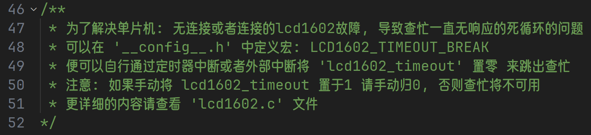

# 目录
- [目录](#目录)
- [更新](#更新)
  - [2024-04-12](#2024-04-12)
    - [封装模块](#封装模块)
- [使用方法](#使用方法)
  - [导入项目](#导入项目)
    - [正常创建 Keil 项目, 并将需要的封装库加入到项目.](#正常创建-keil-项目-并将需要的封装库加入到项目)
    - [在项目目录下创建'__config__.h'文件, 并按照每个库头文件的要求进行宏定义](#在项目目录下创建configh文件-并按照每个库头文件的要求进行宏定义)
    - [在'main.c'文件中导入需要的头文件, 并根据头文件给出的接口进行调用](#在mainc文件中导入需要的头文件-并根据头文件给出的接口进行调用)
- [c51\_lib](#c51_lib)

# 更新
## 2024-04-12
### 封装模块
  - buzzer
  - delay
    - 11.0592MHz 
      - 10us * t
      - 1ms * t
    - 12MHz
      - 10us * t
      - 1ms * t
  - hc_sr04
  - key_4x4
  - lcd1602
  - motor
    - dc motor
    - stepping motor

# 使用方法
## 导入项目
### 正常创建 Keil 项目, 并将需要的封装库加入到项目. 
  - 如果整个文件夹一起装入项目, 可以选择:
    - 在 Keil C51/C 里面添加文件路径
    - include 加入路径: '#include "hc_sr04/hc_sr04.h"'
  - 如果直接将文件复制到了项目路径, 那正常导入便好
### 在项目目录下创建'__config__.h'文件, 并按照每个库头文件的要求进行宏定义
  - 每个头文件都将需要定义和可以选择定义的宏解释了的, 项目里面也有示例
  - 示例
 
'\_\_config__.h'

'lcd1602.h'

### 在'main.c'文件中导入需要的头文件, 并根据头文件给出的接口进行调用
  - 接口都给的很简单, 可以直接使用
  - 示例

'main.c'

'lcd1602.h'

'hc_sr04.h'

'hc_sr04.c'

# c51_lib
关于c51常用的一些模块的封装库
